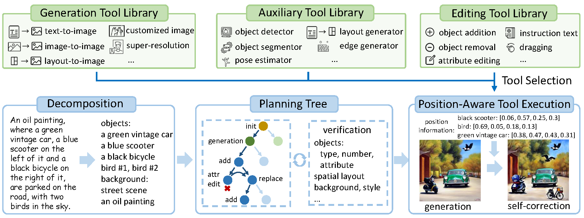

# GenArtist

This repo provides the official code of our NeurIPS 2024 spotlight paper:
> [**GenArtist: Multimodal LLM as an Agent for Unified Image Generation and Editing**](https://arxiv.org/),        

We propose GenArtist, a unified image generation and editing system, coordinated by a multimodal large language model (MLLM) agent.
In GenArtist:
1. Integrate a diverse range of existing models into the tool library.
2. The LLM agent conducts tool selection and execution.
3. A unified system for image generation, editing, verification and self correction.

<p align="center">  </p>

## Installation Guide

Please refer to the requirements.txt file for the necessary environment setup. Since our framework includes several existing methods as tools, it is also essential to ensure that these existing methods can run successfully.

In addition to the methods included in this repo as tools, other commonly used tools involved include: [**stable-diffusion-2-1-base**](https://huggingface.co/stabilityai/stable-diffusion-2-1-base), [**stable-diffusion-xl-base-1.0**](https://huggingface.co/stabilityai/stable-diffusion-xl-base-1.0), [**stable-diffusion-xl-refiner-1.0**](https://huggingface.co/stabilityai/stable-diffusion-xl-refiner-1.0).

The organization of the relevant necessary checkpoints paths is as follows:
```bash
GenArtist
├──AnyDoor
|  ├──path
|  |  ├──dinov2_vitg14_pretrain.pth
|  |  ├──epoch=1-step=8687.ckpt
├──GroundingDINO
|  ├──weights
|  |  ├──groundingdino_swint_ogc.pth
├──Inpaint-Anything
|  ├──pretrained_models
|  |  ├──big-lama
├──instruct-pix2pix
|  ├──checkpoints
|  |  ├──MagicBrush-epoch-000168.ckpt
```

## Usage
For text-to-image genertaion, run demo_t2i.py directly
~~~
python demo_t2i.py
~~~

The workflows for various operations are listed in the relevant .json files within the demo/ directory. Subsequently, tool execution can be performed by running agent_tool.py directly.
~~~
python agent_tool.py
~~~

## MLLM prompts

The prompts for MLLM used for image generation, editing, and self-correction are located in the prompts/ directory. These prompts can be pasted into GPT-4 to obtain the content for the related JSON file operations.
